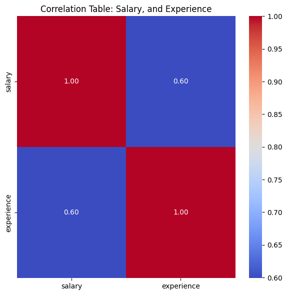

# DS-SalaryPredictor
Predicting Data Scientist Job Salaries: A data science project focused on predicting salaries for data scientists using machine learning techniques and relevant job market data. We are focusing on the data obtained from job portal webpages: Naukri.com and Glassdoor

## Installation
1. Make sure you have Python installed on your system.
2. Install the necessary dependencies by running the following command: pip install selenium pandas
3. Download and install the appropriate web driver for Selenium (e.g., ChromeDriver for Google Chrome).
- Visit the official Selenium documentation for detailed instructions on driver installation: [Selenium WebDrivers]
- (https://www.selenium.dev/documentation/en/webdriver/driver_requirements/)

## Usage (Folder: 'scraper_rawdata')
1. Open the data scraping notebook (glassdoor/Naukri) in a text editor.
2. Customize the script to specify your desired scraping parameters, such as the target website, search queries, or any additional options.
3. Run the script on VS code or Jupyter environment.
4. The script will launch a web browser controlled by Selenium and start scraping the job data.
5. After the scraping process is complete, the raw data will be saved to a CSV file (`job_data.csv`).
6. If you require access to the raw data, I have included two CSV files in this folder."

### Data Description
The raw data (`...csv` files) obtained from the scraping process includes the following fields:
- Job Title: The title or position of the job.
- Company: The company offering the job position.
- Location: The location of the job.
- Salary: The salary estimate or range (if available).

## Usage (Folder: 'Clean_data')

This folder contains the cleaned datasets and the script used to clean the raw data.

### Contents

- `cleaning_rawdata.ipynb`: This Python script was used to clean the raw data and generate the cleaned datasets. It includes the necessary data cleaning steps, such as removing duplicates, handling missing values, and transforming the data.

- `salary_clean_glassdoor.csv`: This file is the cleaned version of "datascientist_salary_glassdoor.csv" under the 'scrapper_raw_data' folder.

- `salary_clean_naukri.csv`:This file is the cleaned version of "datascientist_salary_naukri.csv" under the 'scrapper_raw_data' folder. It has been processed to address data quality issues and is ready for analysis.

Feel free to explore the cleaned datasets and use them for further analysis or research purposes.

## Usage (Folder: EDA_naukri_glassdoor)

This repository contains the EDA files and associated figures generated during the exploratory data analysis process.

### Folder Structure

- `EDA-naukri-glassdoor/`: The main folder containing the EDA files and associated figures.
  - `Figures/`: Subfolder containing all the visualizations generated during the EDA for the naukri and glassdoor dataset.
  - `.ipynb`: Jupyter Notebook script used for generating the EDA figures.

### Description

The EDA-files-figures folder contains the Jupyter Notebook script that was used to perform exploratory data analysis on the datasets. The script includes code for various data visualization techniques and statistical analysis.

The Figures folder contains all the visualizations generated during the EDA process. These figures provide insights into the data, including distributions, trends, correlations, and other relevant information.

### EDA Figures

Here are a few examples of the EDA figures included in this repository:

*Figure 1: Distribution of data related jobs across different states in India (as per data from Naukri.com, June 8th 2023)*

*Figure 2: Distribution of Salary based on Jobtitle and Experience*

*Figure 3: Barplot of Top 10 Companies with the Highest Job Opportunities*

*Figure 4: Correlation Heatmap of Salary and Experience*

Please refer to the Jupyter Notebook script for more detailed code and additional visualizations.

### Key Insights from Naukri.com Dataset Exploration

1. Bangalore Shines Bright: Among metropolitan cities, Bangalore in Karnataka state emerges as a prime hub offering the highest job opportunities. Its vibrant tech ecosystem attracts professionals from diverse fields.

2. Data Scientists' Dominance: Within the data science domain, it is evident that the average salary of data scientists surpasses that of other job roles. The demand for their expertise and specialized skills drives this trend.

3. Unveiling Salary-Experience Link: The correlation coefficient of 0.6 between salary and experience unveils a moderately positive linear relationship. However, it's crucial to note that experience alone may not be the sole determinant of salary. Other influential factors encompass job performance, education, industry dynamics, and prevailing market conditions.

These findings shed light on the prominent patterns observed in the Naukri.com dataset, empowering job seekers and industry enthusiasts with valuable insights into job opportunities, salary trends, and the intricate relationship between experience and earnings.

## Usage (Folder: model_build)
This folder contains a Jupyter notebook showcasing various regression models applied to the dataset. I have added my templated for mutiple linear regression, polynomial regression, and random forest regresssion. The predictions of test data are off from the real values. Here are my learnings from my first ML project.

### Learnings

While working on the regression models for this dataset, the following learnings and insights were gained:

- **Need for Additional Features:** The performance of the models suggests that there is a potential benefit in including additional relevant features in the dataset. This could provide more insights and improve the predictive capability of the models.

- **Model Evaluation and Selection:** The process of trying out various regression models allowed for a comparison of their performance. This exercise provided insights into the strengths and weaknesses of different models and helped identify the most suitable models for this dataset.

- **Need for More Data Points:** The available dataset contained a limited number of data points. Increasing the size of the dataset would provide a larger and more diverse set of samples for the models to learn from. This could potentially improve the generalization and predictive capability of the models.

Overall, this project has provided valuable insights and highlights areas for future improvement. By incorporating additional relevant features and applying further feature engineering techniques, it is anticipated that the model predictions can be further enhanced.

## Acknowledgments
- Ken Jee for providing inspiration and project ideas through his YouTube videos. 
  Note: The scripts and data included in this repository are my own work.
- The prompt and time-saving qualities of ChatGPT have been instrumental in accelerating my progress and providing insightful guidance.
- The Selenium project for providing a powerful web automation framework.
- The Pandas library for data manipulation and analysis.

## Contact Information
For any questions or feedback, please contact me at pritigupta.ds@gmail.com

